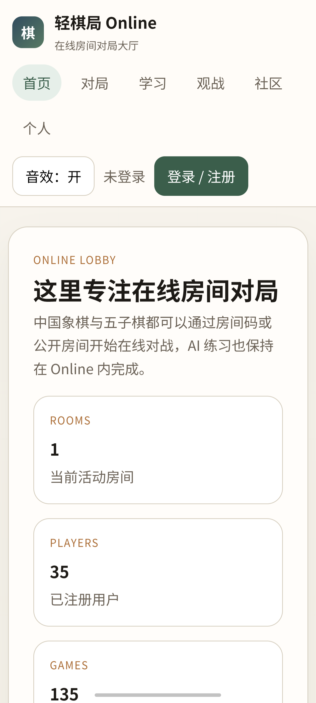

# Android 壳应用部署评审报告 (Android Web App Wrapper Review)

本评审报告记录了将“轻棋局 Online”封装为 Android 应用并部署到真机上的验证结果。

## 1. 验证对象
- **APK 生成路径**：`deploy/android-app/app/build/outputs/apk/debug/app-debug.apk`
- **目标设备**：vivo V2458A (Android 16, SDK 36)
- **应用包名**：`com.example` (MainActivity)

## 2. 部署与唤起测试
- **ADB 安装**：通过 `adb install -r` 一键安装，上报 `Success`。
- **Activity 唤起**：通过 `adb shell am start` 成功拉起 Intent。

## 3. 界面与功能验证
- **加载状态**：WebView 成功请求 `https://www.xiangqiarena.com/`，完全加载轻棋局 Online 的首页和大厅。
- **UI 适配度**：设备为 Fullscreen 无 Actionbar 主题，顶底栏布局自适应良好，按钮（登录、音效控制等）均清晰可见，没有缩放拉伸和白边。
- **DOM 存储与 JS 运行**：大厅数据（房间数、注册人数）可正常获取并动态渲染。

## 4. 真机运行截图证明

以下为使用 `android screen capture` 在真机上抓取的屏幕验证截图：

