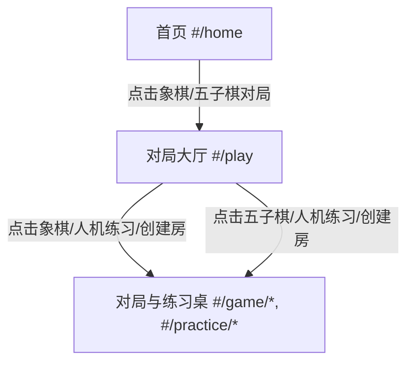

# Design Spec: Online Guofeng Complete Replica Redesign

本设计说明书旨在彻底复刻参考效果图（`ChatGPT Image 2026年6月4日 11_14_23.png`）所示的极致国风水墨轻棋局站点。

## 1. 视觉系统与排版 (Visual & Typography)

### 色彩系统 (Color Palette)
- **纸张色背景**: `--bg: #f5f2e9;` / 渐变色：从左到右或上下 `linear-gradient(180deg, #FAF6EE 0%, #F5EFE0 100%)`
- **容器背景 (米黄卡片)**: `--panel: #fcfaf6;` (有极淡的泥金描边 `--line: #e4dccf;`)
- **主墨黑色 (文字)**: `--ink: #2a2720;`
- **副墨灰色 (辅助文字)**: `--muted: #726a60;`
- **朱砂红 (象棋/主CTA/Logo)**: `--brand-red: #8c2e21;`
- **竹青绿 (五子棋/辅CTA)**: `--brand-green: #2e4d3e;`
- **高亮琥珀金 (高亮态/边框)**: `--brand-gold: #dca35a;`

### 字体 (Typography)
- **大标题与徽章**: `font-family: "KaiTi", "STKaiti", "Songti SC", serif; font-weight: bold;`
- **正文与控件**: `font-family: "Segoe UI", "PingFang SC", "Microsoft YaHei", sans-serif;`

---

## 2. 页面与路由结构重构 (Route & View Remapping)

我们将彻底复刻效果图中的四个核心视图，重构 [app.js](file:///C:/Users/Lenovo/Chinese-chess/src/main/resources/online/app.js) 的渲染输出。

### 2.1 首页 (#/home)
彻底摒弃目前的传统横幅卡片，完全按照效果图左上图复刻：
- **顶部横向导航栏**: 
  - 左侧 Logo (“棋”字朱红徽章 + “轻棋局”大字 + “在线对弈，AI棋桌与复盘分析”副标题)。
  - 中间导航链接：`首页` (激活)、`对局`、`练习`、`排行榜`、`社区`、`会员`、`帮助`。
  - 右侧登录注册区 (朱红色圆角按钮)。
- **主英雄区 (`.deskHero`)**:
  - 居中文字标题：“落子之间，自有风雅”，副标题：“在在线象棋与五子棋对局、轻松开局，随时对弈”。
  - 左侧背景挂载圆形象棋大图插画（包含竹叶装饰及大立体“帅”字棋子）。
  - 右侧背景挂载五子棋大图插画（包含立体黑白棋子与水墨山水）。
  - 中间并排两个大对决入口按钮：“象棋对局” (朱红色卡片)、“五子棋对局” (墨绿色卡片)。
- **快捷小按钮栏 (`.deskQuickGrid`)**:
  - 并排 4 个轻量圆角按钮：“快速匹配”(雷电)、“智能练习”(书本)、“赛事活动”(奖杯)、“棋友社区”(群聊)。
- **底部三栏布局 (`.deskHomeThreeCol`)**:
  - **左栏（对局模式）**: 4 个横卡片快捷操作（快速匹配、智能练习、好友房、人机对战）。
  - **中栏（赛事推荐）**: 列表显示近期比赛（春季象棋公开赛、五子棋周赛、象棋模拟挑战赛），带状态标 (进行中/报名中/未开始) 以及报名/观战人次。
  - **右栏（排行榜周榜）**: 支持象棋/五子棋双分类，展示排名前 4 名 the head/nickname/score。

### 2.2 对局大厅 (#/play)
按照效果图右上图复刻：
- **左侧纵向侧边栏 (`.lobbySidebar`)**:
  - 头像区：用户圆形头像、VIP标与用户名、Lv级别。
  - 侧边按钮组：`首页`、`对局大厅` (高亮，朱红圆角底色)、`人机对战`、`残局练习`、`好友列表`、`消息中心`、`我的棋谱`、`收藏夹`、`设置`。
  - 挂载“每日签到”小木纹卡片。
- **中部大厅主区 (`.lobbyMain`)**:
  - 顶部搜索栏与房间/棋友检索。下方为精美的椭圆分类胶囊 (全部、象棋、五子棋、练习、好友房)。
  - 两张大底图背景卡片：“在线象棋”（卡片右侧是高耸的水墨山峦，左侧有立体木雕“帅”和“将”字棋子）和“五子棋”（右侧是五子棋立体黑白子和木棋盘，以及竹林背景）。
  - 下方为“最近对局”卡片列表，支持棋局回溯复盘。
- **右侧辅助边栏 (`.lobbyAside`)**:
  - 上方“创建或加入房间”卡片，包含朱红的“创建房间”与绿色的“加入房间”大按钮。
  - 下方“排行榜（周榜）”，带分类切换和下方的“查看完整榜单”链接。

### 2.3 象棋对弈/练习桌 (#/game/*, #/practice/*)
按照效果图左下图复刻：
- **背景墙**: 灰绿色的山水江流，左下角伴有孤舟垂钓的水墨装饰。
- **三栏布局 (`.boardDesk`)**:
  - **左栏 (玩家卡片栏)**: 
    - 上方对手：圆形头像、金边框、段位徽章、剩余时间计时器（例如大字 `14:32`，带“红方回合”标）、“局时 15:00 步时 01:30”等参数。
    - 下方玩家：同样格式的头像、段位、大字剩余时间（例如 `13:48`，带“白方回合”标）。
  - **中栏 (自适应棋盘区)**:
    - 采用精细木纹背景的象棋棋盘。
    - 楚河汉界上清晰写着“楚河　汉界”。
    - 底部有一排圆角木质边框控制按钮：“悔棋”、“求和”、“认输”、“离开”。
  - **右栏 (走子记录面板)**:
    - 顶部 Tab 切换：`棋谱` (激活)、`聊天`、`观战`。
    - 中间显示精致的走法记录（红方、黑方分栏），高亮当前步。
    - 底部放置带木纹的控制条（上一局、上一步、下一步、下一局等图形按钮）。

### 2.4 五子棋对弈/练习桌 (#/game/*, #/practice/*)
按照效果图右下图复刻：
- **背景墙**: 满屏竹影婆娑，左下角放有一碗精致的黑白棋罐水墨图。
- **中栏 (自适应五子棋盘区)**:
  - 15x15 五子棋木纹棋盘，黑白棋子具有清晰的立体高光阴影。
  - 底部控制按钮与右栏 Tab（棋谱、分析、聊天）与象棋对局保持视觉一致，主强调色更改为竹青绿。

---

## 3. UI 实施关键技术设计

### 木纹与水墨背景的最佳方案
- 棋盘底色及木纹直接通过 CSS 的 `linear-gradient` 与 `radial-gradient` 叠加实现质感木纹，不再使用单调色。
- 利用绝对定位叠加层 (如 `.boardDesk::before`, `.boardDesk::after`)，使用 `mix-blend-mode: multiply` 融合已内联 of Base64 古风艺术插图。
- 所有三栏面板都加上细金边 (`border: 1px solid var(--line); box-shadow: 0 4px 12px rgba(42,39,32,0.04)`)，使得组件立体又不过于现代。
