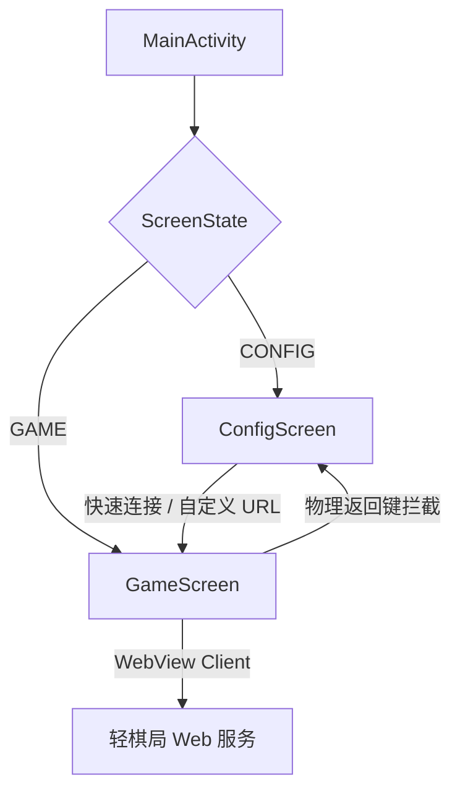

# 手机轻棋局 Android App 编译与部署设计

本规范定义了“轻棋局”手机 Android App 包装壳的设计、功能以及其在实体/模拟器设备上的编译部署机制。

## 1. 软件架构设计

该移动端 App 基于 **Android Jetpack Compose + Native WebView** 混合架构构建，旨在提供极轻量的多棋局容器：



### 1.1 首屏环境引导 (ConfigScreen)
- **国风设计**：整体采用轻棋局统一的“米杏”暖黄色微渐变背景 (`#F6F3EB`)。
- **书法大字**：醒目的红色背景圆形图标，内含白色毛笔字“棋”，呼应棋类风雅。
- **环境切换**：
  - **公网生产环境**：`https://www.xiangqiarena.com/online`，用于玩家进行真实的残局挑战和在线对弈。
  - **模拟器开发环境**：`http://10.0.2.2:18488/online`，方便在 Android 模拟器与本地 Java 服务间测试。
  - **自定义 URL**：支持自由输入局域网 IP 或者局内调试地址。

### 1.2 棋局加载容器 (GameScreen)
- **沉浸式 WebView**：启用 JavaScript、DOM 存储和 H2/Database 功能，自适应宽度展示棋盘。
- **防止白屏闪烁**：将 WebView 与容器的背景色设为 `#F6F3EB`，在加载网页前显示“古风雅局，正在铺设...”的国风过渡动画。
- **返回拦截**：重写 `BackHandler`。若 WebView 中可以后退则执行网页后退；若退无可退，则回到引导页以便用户切换服务器或重新加载。

## 2. 编译与运行规范

### 2.1 依赖与编译条件
- **Gradle 版本**：由 Wrapper 自带 gradle 处理。
- **编译命令**：在 `C:\Users\Lenovo\Chinese-chess\deploy\android-app` 路径下执行：
  ```bash
  ./gradlew assembleDebug
  ```
- **产物位置**：`deploy/android-app/app/build/outputs/apk/debug/app-debug.apk`

### 2.2 部署目标
- **目标设备**：已连接的安卓设备（序列号：`10AF530FSX002KA`）。
- **安装方式**：
  ```bash
  adb -s 10AF530FSX002KA install -r <apk_path>
  ```
- **拉起应用**：
  ```bash
  adb -s 10AF530FSX002KA shell am start -n com.example/com.example.MainActivity
  ```

## 3. 验收标准与验证方案

- **编译成功**：Gradle 成功打出 debug 包，无 Kotlin 语法及 Android SDK 版本冲突报错。
- **安装与运行**：应用能成功推送到 `10AF530FSX002KA`，并在拉起后首屏显示出带有“棋”字和连接按钮的古风 ConfigScreen 界面。
- **验证手段**：使用截图指令获取手机屏幕，确认为国风引导页及正常 WebView 棋盘。
