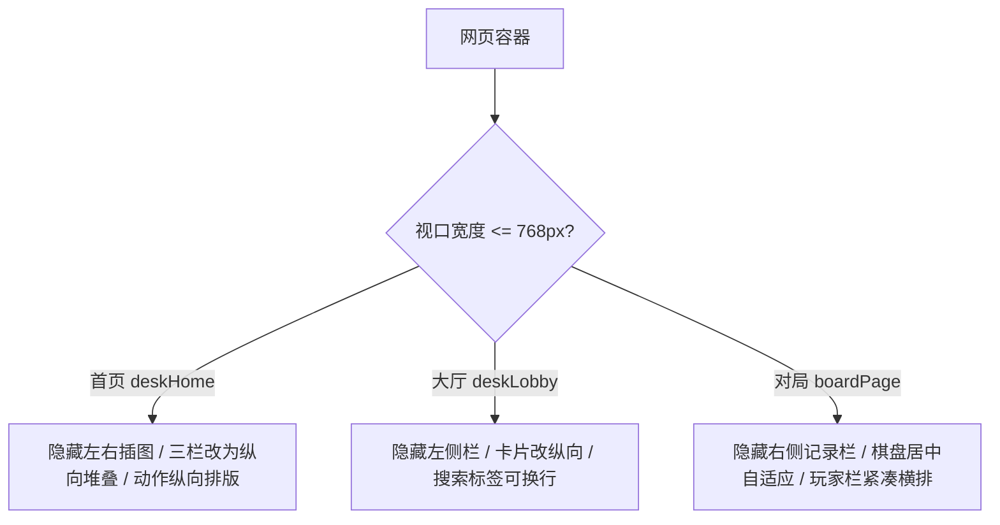

# 手机轻棋局 移动端响应式布局优化设计

本规范定义了“轻棋局”网页版（online 模块）在手机移动端（WebView/窄屏）下的响应式自适应布局设计。

## 1. 现状与错乱分析

现有的“桌面端国风重构”在大屏幕上显示精美，但缺少移动端响应式适配，导致手机 WebView 渲染时产生以下严重问题：
1. **插图遮挡**：Hero 首屏的绝对定位国风插图（200px 大小）在手机上会与中间文字标题发生重叠，甚至把主连接按钮挤到视口下方。
2. **多栏网格挤压**：首页底部三栏与对局大厅侧边栏在手机窄屏上被强行缩放，导致文字截断和整体溢出，页面只渲染了一半。
3. **对弈页布局颠倒**：原本的对弈页为三栏布局，直接堆叠会导致左侧信息（头像、规则、时钟）把第一屏占满，用户必须往下滑动才能看到棋盘，导致无法同时观察时间与落子。

## 2. 优化方案设计

在 CSS 中，基于 `@media (max-width: 768px)` 媒体查询在项目末尾追加高优先级覆盖规则，实现窄屏自适应：

### 2.1 首页与大厅
- **消除绝对定位插图**：设置 `.deskHeroIllustLeft, .deskHeroIllustRight { display: none !important; }`。
- **去除多栏网格**：
  - 首页底部三栏 `.deskHomeThreeCol` 与大厅大容器 `.deskLobby` 改为 `grid-template-columns: 1fr !important;`。
  - 由于大厅在移动端已提供底部导航 `.bottomNav`，因此直接隐藏左侧边栏 `.deskSidebar { display: none !important; }`。
- **胶囊与按钮**：快速入口图标改为 `repeat(2, 1fr)` 的 2x2 网格，大厅活动卡片 `.deskLobbyCards` 变为单列。

### 2.2 极致精简对弈页
- **隐藏步法记录**：隐藏右侧 `.boardSidebar`，在手机窄屏上腾出空间。
- **重构选手栏 (boardRail)**：
  - 隐藏大标题 `.boardRailHeader` 与冗余文字 `.boardRailNote`。
  - 将 `.boardRail` 容器改写为 flex 横排，宽度 100%。
  - 内部的黑红方玩家卡片 `.boardPlayerCard` 宽度各占 47%，横向紧凑平铺于棋盘正上方，可实时观测对方时钟。
- **棋盘尺寸与微调**：
  - `--xi-cell-size` 利用 `vw` 自适应适配：`clamp(28px, 9.2vw, 42px)`，确保象棋在各种手机上都能占满 90% 以上视口宽度。
  - 控制按钮 `.woodActions` 均分宽度并置于棋盘下方。

## 3. 验收标准

- 大厅首页卡片在窄屏下不发生横向溢出，所有主 CTA 在首屏完全可见。
- 进入对局页或人机练习页时，玩家卡片与倒计时紧凑横排在棋盘上方，棋盘主体能 100% 居中，悔棋/认输等动作按钮在其下方，无需滑动即可完成整盘棋局的对弈操作。
