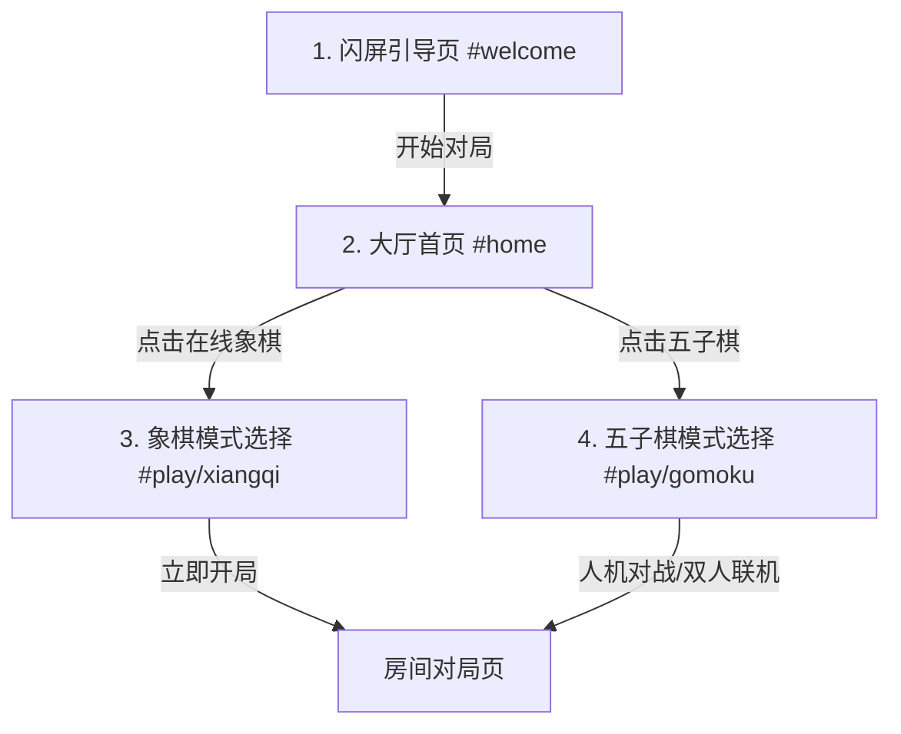

# 国风水墨“轻棋局”移动端界面重构设计说明书 (Guofeng UI Redesign Spec)

本说明书根据用户提供的 ChatGPT 设计效果图，为“轻棋局 Online”构建一套极致美学的水墨国风 UI 设计系统，并对其移动端/WebView 的整体布局与功能流转进行重构。

## 1. 视觉系统与核心调色板 (Core Palette)

重构后的视觉风格定位为**“国风、典雅、水墨”**。

| 变量名 | 色值 | 视觉用途 | 备注 |
| :--- | :--- | :--- | :--- |
| `--bg` | `#F7F4EB` | 宣纸色背景 | 贯穿所有页面的米色质感底色 |
| `--panel` | `#FCFAF5` | 浅米白卡片背景 | 略白于宣纸色，凸显卡片层级 |
| `--line` | `#E1D6C5` | 细润泥金边框线 | 卡片与板块的分隔细线 |
| `--ink` | `#2A2720` | 炭黑色主文本 | 绝非纯黑，而是带暖调的浓墨色 |
| `--muted` | `#7D756C` | 烟灰色次文本 | 相当于干笔水墨灰，用于辅助信息 |
| `--brand-red` | `#8C2E21` | 朱砂红强调色 | 主按钮（如“开始对局”、“立即开局”）、Logo 色 |
| `--brand-green`| `#2E4D3E` | 竹青绿辅助强调色 | 五子棋界面的主色调、副按钮色 |
| `--accent-gold`| `#D99443` | 琥珀金 | 选中的高亮等 |

### 字体 (Typography)
- 标题及大字装饰建议使用楷体衬线字形：`"KaiTi", "STKaiti", "Noto Serif SC", serif`，以增强水墨行书韵味。
- 正文使用圆润且易读的非衬线字体：`"PingFang SC", "Microsoft YaHei", sans-serif`。

## 2. 页面流转与路由重构

页面需要适配移动端 WebView 的四步流程（对应设计图的 4 个页面）：

### 2.1 闪屏页 (#welcome)
- 水墨大 Logo（带背景中国结和书法圆盘配图）。
- 圆形水墨艺术插图：包含写意山水、楚河汉界棋盘、立体象棋“帅”和“将”、以及散落的五子棋黑白棋子。
- 诗句：“落子之间，自有风雅。在线象棋与五子棋对局，轻松开局，随时对弈”。
- 底部朱砂红“开始对局”主按钮。

### 2.2 首页/大厅 (#home)
- 顶部问候语（“午安，棋友，愿你落子从容，胜负皆风雅。”）及搜索条。右侧背景有一点淡淡的水墨山峦，还有个聊天图标。
- 分类标签切换（全部、象棋、五子棋、练习、好友房）。
- 双入口卡片：“在线象棋”与“五子棋”，卡片右上角带装饰配图。
- 底部最近对局卡片列表（“继续对局”）。
- 底部固定导航栏，带有首页（高亮）、对局、悬浮创建按钮、排行、我的。

### 2.3 象棋选择模式页 (#play/xiangqi)
- 顶部为楚河汉界的水墨插画：水墨山水背景，楚河汉界木纹棋盘，上有立体雕刻“帅”和“将”棋子。
- 顶端带有“<”返回按钮，中间带有印章风格的“楚河汉界”文字。
- 特性介绍（“你将获得”）与右侧卡片式单选模式（“标准模式 20分钟场”、“3分钟快棋”、“友谊对局”）。
- 朱砂红按钮“立即开局”。

### 2.4 五子棋选择模式页 (#play/gomoku)
- 顶部为五子棋水墨插画：水墨竹林背景，木纹棋盘，立体的黑白棋子，右下角带有石制棋罐。
- 核心功能四个大卡片：“人机对战”、“双人联机”、“复盘记录”、“胜率统计”。
- 墨绿色按钮“开始对局”。

## 3. 核心国风水墨插画设计

为了完美还原原图极具美感的水墨界面，杜绝纯字符/纯颜色的简陋感，特通过 AI 生成三张高度定制的国风写意插画，并统一进行 WebP 格式压缩（以限制体积在 20KB 以内），以 Base64 格式内嵌至 `app.css`，解决移动端 WebView 加载相对路径图片 404 及反向代理慢的痛点：

1. **`welcome_illust`**: 首屏圆形插图，柔和国风，楚河汉界棋盘，竹林山水，立体“帅/将”与散落的五子棋黑白子。
2. **`detail_xiangqi`**: 象棋选择页顶部图及大厅卡片图，淡雅山水为底，楚河汉界，立体木质雕刻“帅”、“将”棋子置于其上。
3. **`detail_gomoku`**: 五子棋选择页顶部图及大厅卡片图，水墨竹林，几颗圆润饱满的立体黑白棋子置于木纹棋盘，一旁配有石质棋罐。

